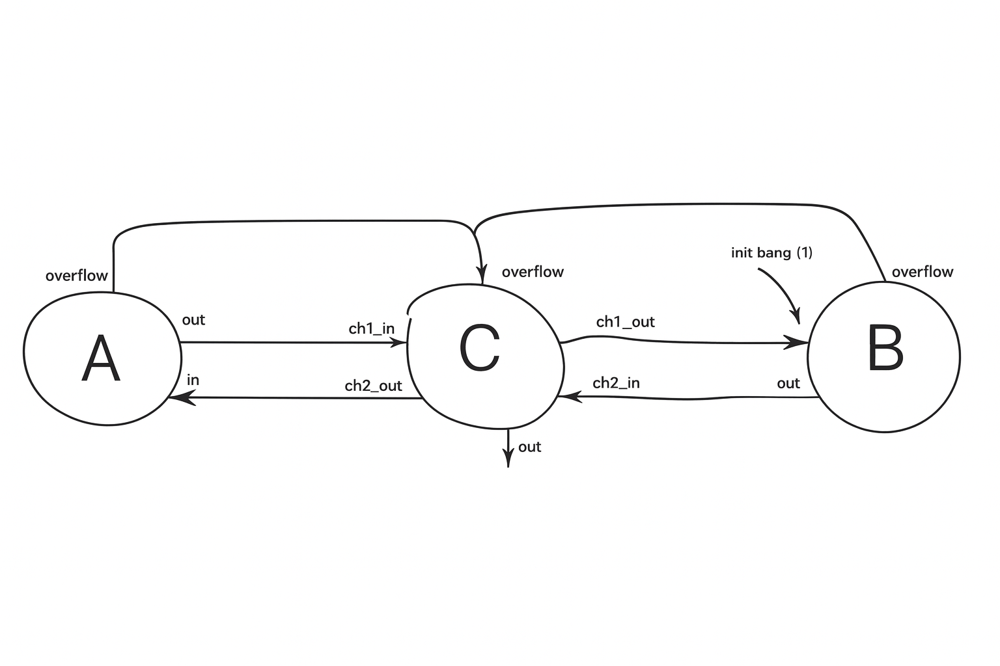

# 🐦 Emu  
### *Песочница для построения сетей взаимодействующих конечных автоматов*

Emu — это лёгкий рантайм для конструирования, соединения и выполнения **сетей взаимодействующих конечных автоматов (FSM)**.  
Он предоставляет простой и выразительный способ:

- определять **локальное поведение** небольших программируемых машин  
- соединять их в **каузальную сеть обмена сообщениями**  
- запускать систему с **детерминированным событийным исполнением**

Emu — это не симулятор.  
Каждый узел работает на **реальной стековой виртуальной машине**, а слой передачи сообщений — **заменяемый**.  
Транспорт по умолчанию — общая очередь FIFO, удобная для обучения, экспериментов и прототипирования.

---

## 🚧 Модель и область применения

Emu реализует чистую, высокоуровневую модель вычислений:

- ✔ детерминированность  
- ✔ событийное исполнение  
- ✔ конечное состояние  
- ✔ явная топология  
- ✔ причинно‑следственный поток данных  

Emu **не** моделирует:

- ✘ физическое время  
- ✘ параллелизм или интерливинги  
- ✘ гонки, опасные состояния, метастабильность  
- ✘ недетерминированные переходы  

Благодаря этому Emu остаётся предсказуемым, анализируемым и удобным для рассуждений.

---

# 🏗️ Emu как реальный рантайм

Каждый узел в Emu содержит **детерминированную стековую виртуальную машину**:

- стек  
- небольшой набор инструкций  
- локальное состояние  
- строгие, детерминированные семантики  

Виртуальная машина не симулируется — это полноценный исполнительный механизм.

Единственный заменяемый компонент — **транспортный слой**.  
Вместо очереди FIFO можно использовать:

- шину сообщений  
- систему аппаратных прерываний  
- распределённый транспорт  
- пользовательский планировщик  

Логика узлов и работа VM при этом не меняются.

---

# 🎓 Путь освоения

Рекомендуемая последовательность изучения:

### **1 — Запустите первую сеть**  
Начните с примера Фибоначчи ниже.

### **2 — Поймите, что такое узел**  
Узел содержит:
- локальное состояние  
- обработчики (программы VM)  
- выходные порты  

### **3 — Разберитесь с топологией**  
Связи определяют, как события распространяются по сети.

### **4 — Изучите виртуальную машину**  
Инструкции вроде `Load`, `Add`, `Emit`, `Halt`.

### **5 — Постройте свою мини‑сеть**  
Например, два узла, пересылающие числа друг другу.

### **6 — Исследуйте возникающее поведение**  
Обратные связи, счётчики, конвейеры, осцилляции.

---

# 🌀 Пример: Сеть Фибоначчи по модулю

Этот пример (из `test_fib_mod.ml`) строит небольшую сеть FSM, генерирующую числа Фибоначчи по модулю.

  
*Диаграмма: причинно‑следственный поток между узлами A, B и C в модульной сети Фибоначчи.*

Узлы A и B вычисляют значения; узел C пересылает их и формирует выходную последовательность.

---

## 🧩 Описание примера

Сеть состоит из трёх взаимодействующих конечных автоматов, каждый из которых работает на внутренней стековой VM Emu.

### **NodeA и NodeB — стековые модульные сумматоры**

NodeA и NodeB — небольшие программируемые автоматы, вычисляющие числа Фибоначчи по модулю.  
Каждый узел хранит два значения:

- текущее число Фибоначчи  
- верхнюю границу (модуль)  

При получении события:

1. VM загружает операнды из стека  
2. Выполняет модульное сложение (`AddMod`)  
3. Проверяет переполнение  
4. Генерирует:
   - **обычное событие**, или  
   - **событие переполнения**  

После вычисления новое значение **передаётся соседу** через NodeC.  
Вместе A и B образуют каузальный цикл, порождающий последовательность Фибоначчи по модулю `ceil`.

---

### **NodeC — оркестратор и контроллер безопасности**

NodeC не выполняет вычислений.  
Он выполняет две функции:

1. **Маршрутизация событий**  
   - принимает значения от A → отправляет B  
   - принимает значения от B → отправляет A  
   - выводит последовательность через порт `out`  

2. **Контроль исполнения**  
   - ведёт внутренний счётчик шагов  
   - останавливает сеть при переполнении в A или B  

NodeC — диспетчер и предохранитель сети.

---

### **Запуск вычислений**

Вся сеть активируется отправкой **bang‑события** в **NodeB**, которое вводит начальное значение `1`.  
С этого момента каузальный цикл A → C → B → C → A начинает генерировать последовательность Фибоначчи по модулю заданного предела.


```ocaml
open OUnit2
open Instructions

let make_vm () =
  Vm.create ~stack_capacity:100 ~max_steps:100

let pp_list lst =
  "[" ^ (String.concat "; " (List.map string_of_int lst)) ^ "]"
  

(* ------------------------------------------------------------ *)
(* Test: Fibonacci network with AddMod                          *)
(* ------------------------------------------------------------ *)

let test_fibonacci_mod_network _ctx =
  let vm = make_vm () in
  let ceil = 21 in

  (* AddMod program *)
  let addmod_prog = [
    AddMod;
    EmitIfNonZero "overflow"; 
    Pop;
    EmitTo "default";
  ] in
  
  let forward_prog ch_out =
    [
      LogStack;
      HaltIfEq (1, 0);
      EmitTo "default";
      EmitTo ch_out;
      Pop;
      PushConst (-1);
      Add;
      LogStack;
    ]
  in

  (* ------------------------------------------------------------ *)
  (* Node A                                                       *)
  (* ------------------------------------------------------------ *)
  let bA = Builder.Node.create ~state:[0; ceil] ~vm in
  let inA = bA.add_handler addmod_prog in
  let outA = bA.add_out_port "default" in
  let outA_overflow = bA.add_out_port "overflow" in
  let nodeA = bA.finalize () in

  (* ------------------------------------------------------------ *)
  (* Node B                                                       *)
  (* ------------------------------------------------------------ *)
  let bB = Builder.Node.create ~state:[0; ceil] ~vm in
  let inB = bB.add_handler addmod_prog in
  let outB = bB.add_out_port "default" in
  let outB_overflow = bB.add_out_port "overflow" in
  let nodeB = bB.finalize () in

  (* ------------------------------------------------------------ *)
  (* Node C                                                       *)
  (* ------------------------------------------------------------ *)
  let limit = 10 in
  let bC = Builder.Node.create ~state:[limit] ~vm in

  let inC_ch1 = bC.add_handler (forward_prog "ch1_out") in
  let inC_ch2 = bC.add_handler (forward_prog "ch2_out") in
  let inC_overflow = bC.add_handler [Halt] in

  let outC = bC.add_out_port "default" in
  let outC_ch1 = bC.add_out_port "ch1_out" in
  let outC_ch2 = bC.add_out_port "ch2_out" in

  let nodeC = bC.finalize () in

  (* ------------------------------------------------------------ *)
  (* Build network using Builder.Net + DSL wiring operator        *)
  (* ------------------------------------------------------------ *)
  let nb, ( --> ) = Builder.Net.create () in

  let idA = nb.add_node nodeA in
  let idB = nb.add_node nodeB in
  let idC = nb.add_node nodeC in

  (* Wiring *)
  (idA, outA) --> (idC, inC_ch1);
  (idC, outC_ch1) --> (idB, inB);
  (idB, outB) --> (idC, inC_ch2);
  (idC, outC_ch2) --> (idA, inA);

  (* Overflow wiring *)
  (idB, outB_overflow) --> (idC, inC_overflow);
  (idA, outA_overflow) --> (idC, inC_overflow);

  let net = nb.finalize () in

  (* ------------------------------------------------------------ *)
  (* Run simulation                                               *)
  (* ------------------------------------------------------------ *)
  let init_snap = Runtime.create ~lifespan:30 net in

  let digest =
    Runtime.run
      ~bang:{ dst = idB; in_port_id = inB; payload = 1 }
      init_snap
  in

  let res_stream =
    Digest.node_out_stream_on_port ~node_id:idC ~out_port:outC digest
  in
  
  assert_equal [1; 1; 2; 3; 5; 8; 13] res_stream;

  Printf.printf "Total steps: %d\n" (Digest.total_steps digest.history);
  Printf.printf "NodeC emitted values: %s\n" (pp_list res_stream)


(* ------------------------------------------------------------ *)

let suite =
  "runtime tests" >::: [
    "test fibonacci modulo" >:: test_fibonacci_mod_network;
  ]

let () = run_test_tt_main suite
```
### Running this produces:

```ocaml
1 1 2 3 5 8 13
```
A Fibonacci sequence emerges from simple local rules and causal wiring.

# 🧪 Running the example
dune test
# 📚 License
MIT (or your license)
